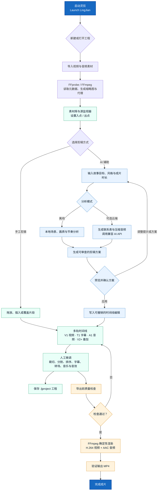

# LingJian AI Video Editor

LingJian is a Windows desktop nonlinear video editor that combines a traditional, editable timeline with optional AI-assisted footage analysis and narrative planning. Local media processing stays on the user's machine; cloud AI is only called after the user provides an API key and starts an analysis.

## Highlights

- Multitrack video, subtitle, original-audio, music, and overlay timeline
- Source/program monitors, in/out points, insert/overwrite editing, trim, split, ripple delete, and undo/redo
- Local scene and quality analysis with proxy generation for difficult media
- Optional multimodal AI analysis through OpenAI-compatible Responses and transcription APIs
- Versioned, reviewable edit plans instead of direct model control over the timeline
- Chronology, clip-boundary, subtitle-readability, transition, and export quality checks
- Deterministic FFmpeg rendering for portrait, landscape, and square H.264/AAC output
- Optional local U²-Net person segmentation and temporally smoothed background effects
- API keys encrypted for the current Windows user with DPAPI

## Editing workflow



The AI path never edits the timeline directly: it produces a validated plan for review, and the user can revise, apply, fine-tune, or undo the result. Imported media and offline analysis remain local; cloud analysis is optional.

## Project layout

```text
.
|-- DOWNLOAD.md             # Windows installer download and checksum
|-- app.py                  # Desktop application and workflow orchestration
|-- core.py                 # Project model, media analysis, and FFmpeg rendering
|-- ai_api.py               # Optional cloud analysis and narrative planning
|-- edit_protocol.py        # Validated, auditable edit-plan layer
|-- timeline_widget.py      # Interactive multitrack timeline
|-- creative_director.py    # Whole-video creative treatment
|-- editing_profile.py      # Locally learned editing preferences
|-- person_ai.py            # Optional local person segmentation
|-- music_library.py        # Bundled generated music metadata
|-- sfx_library.py          # Bundled generated sound-effect metadata
|-- assets/                 # Fonts, music, and sound effects
|-- docs/                   # API setup, current release notes, and design notes
|-- licenses/               # Third-party license texts
`-- tests/                  # Current regression tests
```

## Requirements

- Windows 10 or 11
- Python 3.11+
- FFmpeg and FFprobe available on `PATH`, or `ffmpeg.exe` beside `app.py`

## Run from source

```powershell
git clone https://github.com/MikeKang202210061/lingjian-ai-video-editor.git
cd lingjian-ai-video-editor
python -m venv .venv
.\.venv\Scripts\Activate.ps1
pip install -r requirements.txt
python app.py
```


## Optional person-segmentation model

Download `u2net_human_seg.onnx`, verify its SHA-256 value against `MODEL_SHA256` in `person_ai.py`, and place it at:

```text
models/u2net_human_seg.onnx
```

The model is intentionally excluded from Git because of its size and separate distribution terms. All non-segmentation editing features remain available without it.

## Tests

```powershell
python tests/run_tests.py
```

Additional generated-media tests in `tests/` require FFmpeg. The portable runner covers edit-plan validation, continuity, long-form ordering, personalization, capture order, and the mocked AI workflow.

## Privacy and AI behavior

- Imported media, proxies, project state, and offline analysis remain local.
- API keys are stored with Windows DPAPI and are not written into project files.
- Cloud analysis sends only the derived contact sheets and compressed audio needed for the requested operation.
- AI output is converted into a validated edit plan that the user reviews before applying.

## Documentation

- [API configuration](docs/API_SETUP.md)
- [Current release notes](docs/RELEASE_NOTES.md)
- [Creative-direction design](docs/CREATIVE_DIRECTION.md)
- [Third-party notices](THIRD_PARTY_NOTICES.md)

## Scope

LingJian focuses on editable AI-assisted assembly, short/long-form narrative planning, subtitles, transitions, multitrack composition, and dependable local export. It is not intended to replace the advanced color, compositing, audio, collaboration, or multicamera systems in a full professional post-production suite.
